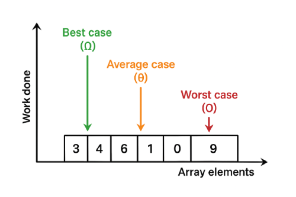

When analyzing algorithms, we often use Big O notation to describe how the runtime grows with input size.
when we talk about Big O, usually mean the **worst case**.



 **O(n) – Linear Time**
  - The running time grows **linearly** with input size `n`. 
  - If array has 5 elements ->  5 steps,1000 elements → 1000 steps.

```python
def linear_t(arr):
    for item in arr:
        print(item)

arr = [1, 2, 3, 4, 5]
linear_t(arr)

```
**Dropping Constants**
 - In Big-O, we ignore constants because they don’t change the **overall growth pattern**.
 ```python
 def constant(arr):
    for item in arr:     
        print(item)
    for item in arr:     
        print(item)

```
- steps n+n times =O(2n)
- Big O ignores 2, so we can simplify by dropping constant = O(n)


**O(n^2)** Quadratic Time
- The time it takes grows as the square of the input size.
```python
def ssquare(arr):
    for i in arr:              # n times
        for j in arr:          # n times for each i
            print(i, j)

```
- if array has 3 items → 3×3 = 9 steps
- if array has 1000 items → 1000×1000 = 1,000,000 steps

 **Dropping Non Dominant **
 - When multiple terms exist, we only keep the **fastest-growing term**, because as `n` gets very large, the smaller terms become insignificant.
```python
def mixed_example(n):
    for item in n:           # n steps
        print(item)
    for i in n:              # n steps
        for j in n:          # n steps
            print(i, j)      # n² steps

```
- The `n²` part → 10,000 steps
- The `n` part → 100 steps
- so,O(n+n^2 ) =  **O(n²)** (drop the smaller n term)

**O(1) – Constant Time**  | Most efficient 
The algorithm takes the **same amount of time** no matter how large the input is.

```python
def constant_example(arr):
    print(arr[0])
``` 
- Whether the list has 10 items or 10 million, accessing `arr[0]` takes the same time. 
Here's another example 
```python
def add_numbers(a, b):
    return a + b    # one operation
```

**Time Complexity with multiple input** 

 Separate Loops
 ```python
 def example1(a, b):
    for x in a: 
        pass
    for y in b:
        pass

```
-  O(a) & O(b) = O(a + b)

Nested Loops → Multiply O(a × b)
```python
	def example2(a, b):
    for x in a:             
        for y in b:         
            pass

```